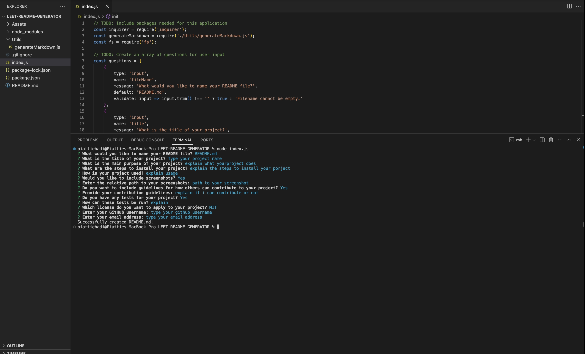

# Leet README Generator

## Description
Leet README Generator is a command-line application that dynamically generates a professional README.md file from a user's input. This tool simplifies the process of creating a detailed README, ensuring that all necessary sections are included and formatted correctly.

## Table of Contents
- [Description](#description)
- [Installation](#installation)
- [Usage](#usage)
- [Contribution](#contribution)
- [Tests](#tests)
- [License](#license)
- [Questions](#questions)

## Installation
Clone this repository to your local machine. Navigate to the project directory and run 'npm install' to install all necessary dependencies.

## Usage
To use the generator, run 'node index.js' from the terminal in the project directory. Follow the prompts to enter project details, and a README.md file will be generated in the specified directory.

## Contribution
Contributions to enhance the functionality of this README generator are welcome. Please fork the repo, create a new branch, commit your changes, and open a pull request.

## Tests
To run the tests, install Jest via 'npm install jest' and then run 'npm run test'. Ensure that your contributions pass all tests before submitting a pull request.

## License
This project is licensed under the MIT license. [License Link](https://choosealicense.com/licenses/mit/)

## Questions
For any questions, please contact me at [piattiehadi@yahoo.com](mailto:piattiehadi@yahoo.com).

GitHub Profile: [Piattiehadi](https://github.com/Piattiehadi)